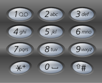

# [LeetCode][leetcode] task # 17: [Letter Combinations of a Phone Number][task]

Description
-----------

> Given a string containing digits from 2-9 inclusive,
> return all possible letter combinations that the number could represent.
> Return the answer in any order.
>
> A mapping of digit to letters (just like on the telephone buttons)
> is given below. Note that 1 does not map to any letters.
>
```phone
1[    ] 2[abc ] 3[def ]
4[ghi ] 5[jkl ] 6[mno ]
7[pqrs] 8[tuv ] 9[wxyz]
```

Example
-------



```sh
Input: digits = "23"
Output: ["ad","ae","af","bd","be","bf","cd","ce","cf"]
```

Solution
--------

| Task | Solution                                          |
|:----:|:--------------------------------------------------|
|  17  | [Letter Combinations of a Phone Number][solution] |


[leetcode]: <http://leetcode.com/>
[task]: <https://leetcode.com/problems/letter-combinations-of-a-phone-number/>
[solution]: <https://github.com/wellaxis/witalis-jkit/blob/main/module/tasks/src/main/java/com/witalis/jkit/tasks/core/task/leetcode/h1/p17/option/Practice.java>
