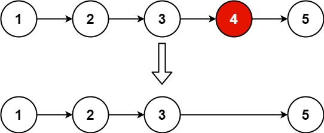

# [LeetCode][leetcode] task # 19: [Remove Nth Node From End of List][task]

Description
-----------

> Given the head of a linked list,
> remove the nth node from the end of the list
> and return its head.



Example
-------

```sh
Input: head = [1,2,3,4,5], n = 2
Output: [1,2,3,5]
```

Solution
--------

| Task | Solution                                     |
|:----:|:---------------------------------------------|
|  19  | [Remove Nth Node From End of List][solution] |


[leetcode]: <http://leetcode.com/>
[task]: <https://leetcode.com/problems/remove-nth-node-from-end-of-list/>
[solution]: <https://github.com/wellaxis/praxis-leetcode/blob/main/src/main/java/com/witalis/praxis/leetcode/task/h1/p19/option/Practice.java>
