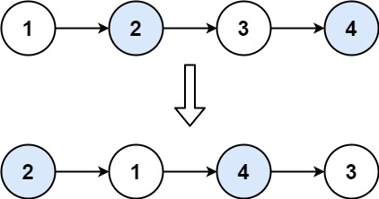

# [LeetCode][leetcode] task # 24: [Swap Nodes in Pairs][task]

Description
-----------

> Given a linked list, swap every two adjacent nodes and return its head.
> You must solve the problem without modifying the values in the list's nodes
> (i.e., only nodes themselves may be changed.)

Example
-------



```sh
Input: head = [1,2,3,4]
Output: [2,1,4,3]
```

Solution
--------

| Task | Solution                        |
|:----:|:--------------------------------|
|  24  | [Swap Nodes in Pairs][solution] |


[leetcode]: <http://leetcode.com/>
[task]: <https://leetcode.com/problems/swap-nodes-in-pairs/>
[solution]: <https://github.com/wellaxis/praxis-leetcode/blob/main/src/main/java/com/witalis/praxis/leetcode/task/h1/p24/option/Practice.java>
