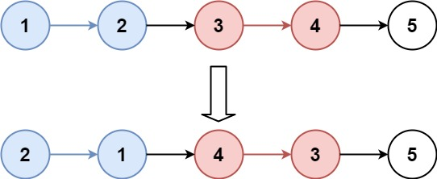

# [LeetCode][leetcode] task # 25: [Reverse Nodes in k-Group][task]

Description
-----------

> Given the `head` of a linked list,
> reverse the nodes of the list `k` at a time,
> and return the _modified list_.
> 
> `k` is a positive integer and is less than or equal
> to the length of the linked list. If the number of nodes
> is not a multiple of `k` then left-out nodes, in the end,
> should remain as it is.
> 
> You may not alter the values in the list's nodes,
> only nodes themselves may be changed.

Example
-------



```sh
Input: head = [1,2,3,4,5], k = 2
Output: [2,1,4,3,5]
```

Solution
--------

| Task | Solution                             |
|:----:|:-------------------------------------|
|  25  | [Reverse Nodes in k-Group][solution] |


[leetcode]: <http://leetcode.com/>
[task]: <https://leetcode.com/problems/reverse-nodes-in-k-group/>
[solution]: <https://github.com/wellaxis/witalis-jkit/blob/main/module/tasks/src/main/java/com/witalis/jkit/tasks/core/task/leetcode/h1/p25/option/Practice.java>
