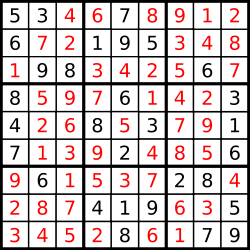

# [LeetCode][leetcode] task # 37: [Sudoku Solver][task]

Description
-----------

> Write a program to solve a Sudoku puzzle by filling the empty cells.
> 
> A sudoku solution must satisfy **all of the following rules**:
>
> 1. Each of the digits `1-9` must occur exactly once in each row.
> 2. Each of the digits `1-9` must occur exactly once in each column.
> 3. Each of the digits `1-9` must occur exactly once in each of the 9 `3x3` sub-boxes of the grid.
>
> The '.' character indicates empty cells.

Example
-------


```sh
Input: board = 
[["5","3",".",".","7",".",".",".","."]
,["6",".",".","1","9","5",".",".","."]
,[".","9","8",".",".",".",".","6","."]
,["8",".",".",".","6",".",".",".","3"]
,["4",".",".","8",".","3",".",".","1"]
,["7",".",".",".","2",".",".",".","6"]
,[".","6",".",".",".",".","2","8","."]
,[".",".",".","4","1","9",".",".","5"]
,[".",".",".",".","8",".",".","7","9"]]
Output: board =
[["5","3","4","6","7","8","9","1","2"]
,["6","7","2","1","9","5","3","4","8"]
,["1","9","8","3","4","2","5","6","7"]
,["8","5","9","7","6","1","4","2","3"]
,["4","2","6","8","5","3","7","9","1"]
,["7","1","3","9","2","4","8","5","6"]
,["9","6","1","5","3","7","2","8","4"]
,["2","8","7","4","1","9","6","3","5"]
,["3","4","5","2","8","6","1","7","9"]]
Explanation: The input board is shown above
    and the only valid solution is shown below:
```



Solution
--------

| Task | Solution                  |
|:----:|:--------------------------|
|  37  | [Sudoku Solver][solution] |


[leetcode]: <http://leetcode.com/>
[task]: <https://leetcode.com/problems/sudoku-solver/>
[solution]: <https://github.com/wellaxis/praxis-leetcode/blob/main/src/main/java/com/witalis/praxis/leetcode/task/h1/p37/option/Practice.java>
