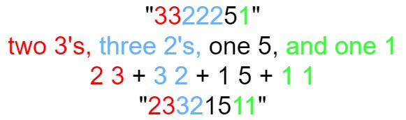

# [LeetCode][leetcode] task # 38: [Count and Say][task]

Description
-----------

> The count-and-say sequence is a sequence
> of digit strings defined by the recursive formula:
* countAndSay(1) = "1"
* countAndSay(n) is the way you would "say" the digit string from countAndSay(n-1),
  which is then converted into a different digit string.
>
> To determine how you "say" a digit string,
> split it into the minimal number of groups so that each group
> is a contiguous section all of the same character.
> Then for each group, say the number of characters, then say the character.
> To convert the saying into a digit string,
> replace the counts with a number and concatenate every saying.
> 
> For example, the saying and conversion for digit string "3322251":
1. "3322251"
2. two 3's, three 2's, one 5, and one 1
3. 2 3 + 3 2 + 1 5 + 1 1
4. "23321511"



> Given a positive integer n, return the nth term of the count-and-say sequence.


Example
-------

```sh
Input: n = 4
Output: "1211"
Explanation:
    countAndSay(1) = "1"
    countAndSay(2) = say "1" = one 1 = "11"
    countAndSay(3) = say "11" = two 1's = "21"
    countAndSay(4) = say "21" = one 2 + one 1 = "12" + "11" = "1211"
```

Solution
--------

| Task | Solution                  |
|:----:|:--------------------------|
|  38  | [Count and Say][solution] |


[leetcode]: <http://leetcode.com/>
[task]: <https://leetcode.com/problems/count-and-say>
[solution]: <https://github.com/wellaxis/praxis-leetcode/blob/main/src/main/java/com/witalis/praxis/leetcode/task/h1/p38/option/Practice.java>
