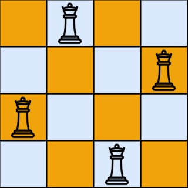

# [LeetCode][leetcode] task # 51: [N-Queens][task]

Description
-----------

> The **n-queens** puzzle is the problem of placing `n` queens
> on an `n x n` chessboard such that no two queens attack each other.
> 
> Given an integer `n`, return _all distinct solutions to the **n-queens puzzle**_.
> You may return the answer **in any order**.
> 
> Each solution contains a distinct board configuration of the n-queens' placement,
> where `'Q'` and `'.'` both indicate a queen and an empty space, respectively.

Example
-------



```sh
Input: n = 4
Output: [[".Q..","...Q","Q...","..Q."],["..Q.","Q...","...Q",".Q.."]]
Explanation: There exist two distinct solutions to the 4-queens puzzle
```

Solution
--------

| Task | Solution             |
|:----:|:---------------------|
|  51  | [N-Queens][solution] |


[leetcode]: <http://leetcode.com/>
[task]: <https://leetcode.com/problems/n-queens/>
[solution]: <https://github.com/wellaxis/praxis-leetcode/blob/main/src/main/java/com/witalis/praxis/leetcode/task/h1/p51/option/Practice.java>
