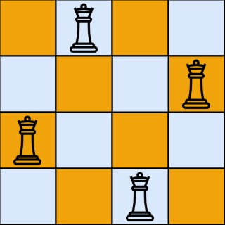

# [LeetCode][leetcode] task # 52: [N-Queens II][task]

Description
-----------

> The **n-queens** puzzle is the problem of placing `n` queens
> on an `n x n` chessboard such that no two queens attack each other.
> 
> Given an integer `n`, return _the number of distinct solutions to the **n-queens puzzle**_.

Example
-------



```sh
Input: n = 4
Output: 2
Explanation: There are two distinct solutions to the 4-queens puzzle.
```

Solution
--------

| Task | Solution                |
|:----:|:------------------------|
|  52  | [N-Queens II][solution] |


[leetcode]: <http://leetcode.com/>
[task]: <https://leetcode.com/problems/n-queens-ii/>
[solution]: <https://github.com/wellaxis/witalis-jkit/blob/main/module/tasks/src/main/java/com/witalis/jkit/tasks/core/task/leetcode/h1/p52/option/Practice.java>
