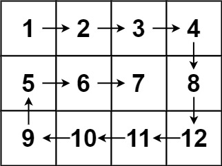

# [LeetCode][leetcode] task # 54: [Spiral Matrix][task]

Description
-----------

> Given an `m x n` `matrix`, return _all elements of the `matrix` in spiral order_.

Example
-------



```sh
Input: matrix = [[1,2,3,4],[5,6,7,8],[9,10,11,12]]
Output: [1,2,3,4,8,12,11,10,9,5,6,7]
```

Solution
--------

| Task | Solution                  |
|:----:|:--------------------------|
|  54  | [Spiral Matrix][solution] |


[leetcode]: <http://leetcode.com/>
[task]: <https://leetcode.com/problems/spiral-matrix/>
[solution]: <https://github.com/wellaxis/witalis-jkit/blob/main/module/tasks/src/main/java/com/witalis/jkit/tasks/core/task/leetcode/h1/p54/option/Practice.java>
