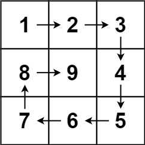

# [LeetCode][leetcode] task # 59: [Spiral Matrix II][task]

Description
-----------

> Given a positive integer `n`, generate an `n x n` matrix
> filled with elements from `1` to `n^2` in spiral order.

Example
-------



```sh
Input: n = 3
Output: [[1,2,3],[8,9,4],[7,6,5]]
```

Solution
--------

| Task | Solution                     |
|:----:|:-----------------------------|
|  59  | [Spiral Matrix II][solution] |


[leetcode]: <http://leetcode.com/>
[task]: <https://leetcode.com/problems/spiral-matrix-ii/>
[solution]: <https://github.com/wellaxis/praxis-leetcode/blob/main/src/main/java/com/witalis/praxis/leetcode/task/h1/p59/option/Practice.java>
