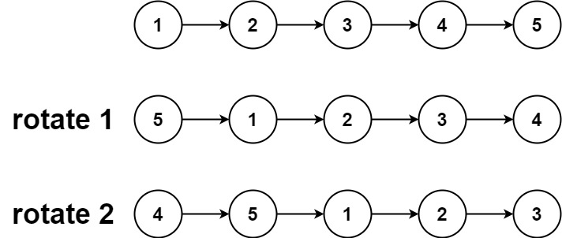

# [LeetCode][leetcode] task # 61: [Rotate List][task]

Description
-----------

> Given the `head` of a linked list,
> rotate the list to the right by `k` places.

Example
-------



```sh
Input: head = [1,2,3,4,5], k = 2
Output: [4,5,1,2,3]
```

Solution
--------

| Task | Solution                |
|:----:|:------------------------|
|  61  | [Rotate List][solution] |


[leetcode]: <http://leetcode.com/>
[task]: <https://leetcode.com/problems/rotate-list/>
[solution]: <https://github.com/wellaxis/witalis-jkit/blob/main/module/tasks/src/main/java/com/witalis/jkit/tasks/core/task/leetcode/h1/p61/option/Practice.java>
