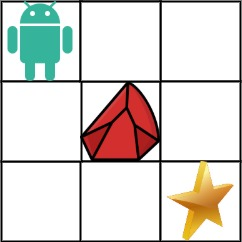

# [LeetCode][leetcode] task # 63: [Unique Paths II][task]

Description
-----------

> A robot is located at the **top-left corner**
> of a `m x n` grid (marked 'Start' in the diagram below).
> 
> The robot can only move either down or right at any point in time.
> The robot is trying to reach the **bottom-right corner**
> of the grid (marked 'Finish' in the diagram below).
> 
> Now consider if some obstacles are added to the grids.
> How many unique paths would there be?
> 
> An obstacle and space is marked as 1 and 0 respectively in the grid.

Example
-------



```sh
Input: obstacleGrid = [[0,0,0],[0,1,0],[0,0,0]]
Output: 2
Explanation: There is one obstacle in the middle of the 3x3 grid above.
    There are two ways to reach the bottom-right corner:
    1. Right -> Right -> Down -> Down
    2. Down -> Down -> Right -> Right
```

Solution
--------

| Task | Solution                    |
|:----:|:----------------------------|
|  63  | [Unique Paths II][solution] |


[leetcode]: <http://leetcode.com/>
[task]: <https://leetcode.com/problems/unique-paths/>
[solution]: <https://github.com/wellaxis/witalis-jkit/blob/main/module/tasks/src/main/java/com/witalis/jkit/tasks/core/task/leetcode/h1/p63/option/Practice.java>
