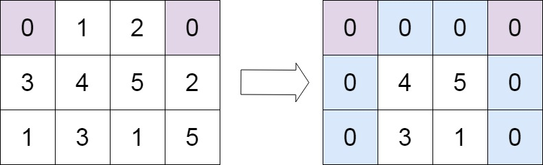

# [LeetCode][leetcode] task # 73: [Set Matrix Zeroes][task]

Description
-----------

> Given an `m x n` integer matrix `matrix`,
> if an element is `0`, set its entire row and column to `0`'s,
> and return _the matrix_.
> 
> You must do it `in place`.

> Follow up:
> * A straightforward solution using `O(mn)` space is probably a bad idea.
> * A simple improvement uses `O(m + n)` space, but still not the best solution.
> * Could you devise a constant `O(1)` space solution?

Example
-------



```sh
Input: matrix = [[0,1,2,0],[3,4,5,2],[1,3,1,5]]
Output: [[0,0,0,0],[0,4,5,0],[0,3,1,0]]
```

Solution
--------

| Task | Solution                      |
|:----:|:------------------------------|
|  73  | [Set Matrix Zeroes][solution] |


[leetcode]: <http://leetcode.com/>
[task]: <https://leetcode.com/problems/set-matrix-zeroes/>
[solution]: <https://github.com/wellaxis/witalis-jkit/blob/main/module/tasks/src/main/java/com/witalis/jkit/tasks/core/task/leetcode/h1/p73/option/Practice.java>
