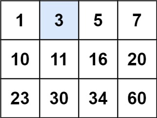

# [LeetCode][leetcode] task # 74: [Search a 2D Matrix][task]

Description
-----------

> Write an efficient algorithm that searches for a value `target`
> in an `m x n` integer matrix `matrix`.
> This matrix has the following properties:
> * Integers in each row are sorted from left to right.
> * The first integer of each row is greater than the last integer of the previous row.

Example
-------



```sh
Input: matrix = [[1,3,5,7],[10,11,16,20],[23,30,34,60]], target = 3
Output: true
```

Solution
--------

| Task | Solution                       |
|:----:|:-------------------------------|
|  74  | [Search a 2D Matrix][solution] |


[leetcode]: <http://leetcode.com/>
[task]: <https://leetcode.com/problems/search-a-2d-matrix/>
[solution]: <https://github.com/wellaxis/witalis-jkit/blob/main/module/tasks/src/main/java/com/witalis/jkit/tasks/core/task/leetcode/h1/p74/option/Practice.java>
