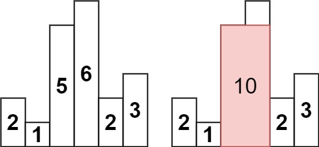

# [LeetCode][leetcode] task # 84: [Largest Rectangle in Histogram][task]

Description
-----------

> Given an array of integers `heights` representing the histogram's bar height
> where the width of each bar is `1`, return _the area of the largest rectangle in the histogram_.

Example
-------



```sh
Input: heights = [2,1,5,6,2,3]
Output: 10
Explanation: The above is a histogram where width of each bar is 1.
The largest rectangle is shown in the red area, which has an area = 10 units.
```

Solution
--------

| Task | Solution                                   |
|:----:|:-------------------------------------------|
|  84  | [Largest Rectangle in Histogram][solution] |


[leetcode]: <http://leetcode.com/>
[task]: <https://leetcode.com/problems/largest-rectangle-in-histogram/>
[solution]: <https://github.com/wellaxis/witalis-jkit/blob/main/module/tasks/src/main/java/com/witalis/jkit/tasks/core/task/leetcode/h1/p84/option/Practice.java>
