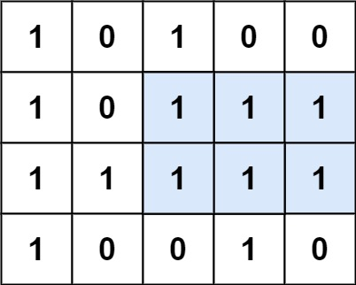

# [LeetCode][leetcode] task # 85: [Maximal Rectangle][task]

Description
-----------

> Given a `rows x cols` binary matrix filled with `0`'s and `1`'s,
> find the largest rectangle containing only `1`'s and return its area.

Example
-------



```sh
Input: matrix = [["1","0","1","0","0"],["1","0","1","1","1"],["1","1","1","1","1"],["1","0","0","1","0"]]
Output: 6
Explanation: The maximal rectangle is shown in the above picture.
```

Solution
--------

| Task | Solution                      |
|:----:|:------------------------------|
|  85  | [Maximal Rectangle][solution] |


[leetcode]: <http://leetcode.com/>
[task]: <https://leetcode.com/problems/maximal-rectangle/>
[solution]: <https://github.com/wellaxis/praxis-leetcode/blob/main/src/main/java/com/witalis/praxis/leetcode/task/h1/p85/option/Practice.java>
