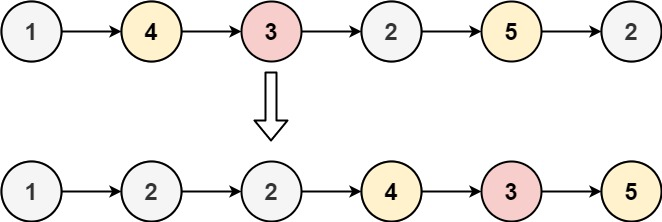

# [LeetCode][leetcode] task # 86: [Partition List][task]

Description
-----------

> Given the `head` of a linked list and a value `x`,
> partition it such that all nodes **less than** `x`
> come before nodes **greater than or equal** to `x`.
> 
> You should **preserve** the original relative order
> of the nodes in each of the two partitions.

Example
-------



```sh
Input: head = [1,4,3,2,5,2], x = 3
Output: [1,2,2,4,3,5]
```

Solution
--------

| Task | Solution                   |
|:----:|:---------------------------|
|  86  | [Partition List][solution] |


[leetcode]: <http://leetcode.com/>
[task]: <https://leetcode.com/problems/remove-duplicates-from-sorted-list/>
[solution]: <https://github.com/wellaxis/witalis-jkit/blob/main/module/tasks/src/main/java/com/witalis/jkit/tasks/core/task/leetcode/h1/p86/option/Practice.java>
