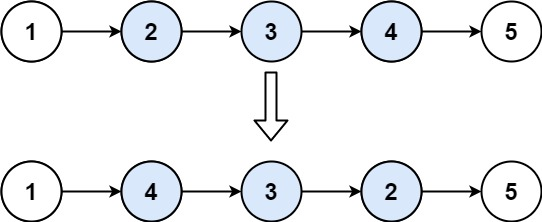

# [LeetCode][leetcode] task # 92: [Reverse Linked List II][task]

Description
-----------

> Given the `head` of a singly linked list and
> two integers `left` and `right` where `left` <= `right`,
> reverse the nodes of the list from position `left` to position `right`,
> and return _the reversed list_.

Example
-------



```sh
Input: head = [1,2,3,4,5], left = 2, right = 4
Output: [1,4,3,2,5]
```

Solution
--------

| Task | Solution                           |
|:----:|:-----------------------------------|
|  92  | [Reverse Linked List II][solution] |


[leetcode]: <http://leetcode.com/>
[task]: <https://leetcode.com/problems/reverse-linked-list-ii/>
[solution]: <https://github.com/wellaxis/witalis-jkit/blob/main/module/tasks/src/main/java/com/witalis/jkit/tasks/core/task/leetcode/h1/p92/option/Practice.java>
