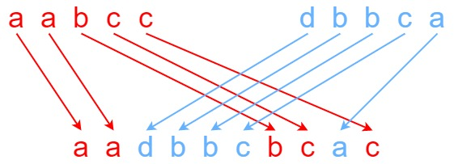

# [LeetCode][leetcode] task # 97: [Interleaving String][task]

Description
-----------

> Given strings `s1`, `s2`, and `s3`,
> find whether `s3` is formed by an **interleaving** of `s1` and `s2`.
> 
> An **interleaving** of two strings `s` and `t` is a configuration
> where they are divided into **non-empty** substrings such that:
> 
> * `s = s1 + s2 + ... + sn`
> * `t = t1 + t2 + ... + tm`
> * `|n - m| <= 1`
> * The **interleaving** is `s1 + t1 + s2 + t2 + s3 + t3 + ...`
> or `t1 + s1 + t2 + s2 + t3 + s3 + ...`
> 
> **Note**: `a + b` is the concatenation of strings `a` and `b`.

> **Follow up**: Could you solve it using only `O(s2.length)` additional memory space?

 Example
-------



```sh
Input: s1 = "aabcc", s2 = "dbbca", s3 = "aadbbcbcac"
Output: true
```

Solution
--------

| Task | Solution                        |
|:----:|:--------------------------------|
|  97  | [Interleaving String][solution] |


[leetcode]: <http://leetcode.com/>
[task]: <https://leetcode.com/problems/interleaving-string/>
[solution]: <https://github.com/wellaxis/praxis-leetcode/blob/main/src/main/java/com/witalis/praxis/leetcode/task/h1/p97/option/Practice.java>
