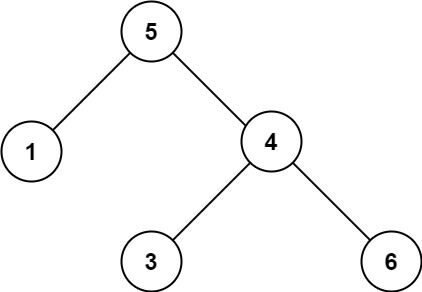

# [LeetCode][leetcode] task # 98: [Validate Binary Search Tree][task]

Description
-----------

> Given the `root` of a binary tree,
> _determine if it is a valid binary search tree (BST)_.
> 
> A **valid BST** is defined as follows:
> * The left subtree of a node contains only nodes with keys **less than** the node's key.
> * The right subtree of a node contains only nodes with keys **greater than** the node's key.
> * Both the left and right subtrees must also be binary search trees.

 Example
-------



```sh
Input: root = [5,1,4,null,null,3,6]
Output: false
Explanation: The root node's value is 5 but its right child's value is 4.
```

Solution
--------

| Task | Solution                                |
|:----:|:----------------------------------------|
|  98  | [Validate Binary Search Tree][solution] |


[leetcode]: <http://leetcode.com/>
[task]: <https://leetcode.com/problems/validate-binary-search-tree/>
[solution]: <https://github.com/wellaxis/praxis-leetcode/blob/main/src/main/java/com/witalis/praxis/leetcode/task/h1/p98/option/Practice.java>
