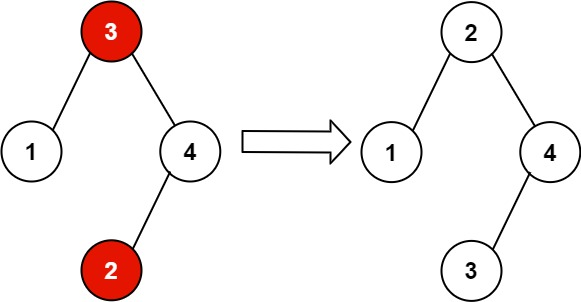

# [LeetCode][leetcode] task # 99: [Recover Binary Search Tree][task]

Description
-----------

> You are given the `root` of a binary search tree (BST),
> where the values of **exactly** two nodes of the tree were swapped by mistake.
> _Recover the tree without changing its structure_.

 Example
-------



```sh
Input: root = [3,1,4,null,null,2]
Output: [2,1,4,null,null,3]
Explanation: 2 cannot be in the right subtree of 3 because 2 < 3.
             Swapping 2 and 3 makes the BST valid.
```

Solution
--------

| Task | Solution                               |
|:----:|:---------------------------------------|
|  99  | [Recover Binary Search Tree][solution] |


[leetcode]: <http://leetcode.com/>
[task]: <https://leetcode.com/problems/recover-binary-search-tree/>
[solution]: <https://github.com/wellaxis/witalis-jkit/blob/main/module/tasks/src/main/java/com/witalis/jkit/tasks/core/task/leetcode/h1/p99/option/Practice.java>
