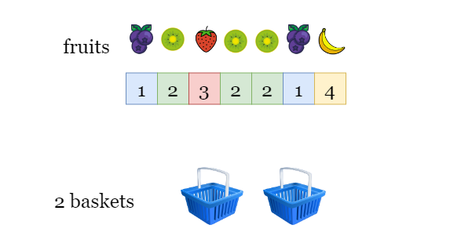

# [LeetCode][leetcode] task # 904: [Fruit Into Baskets][task]

Description
-----------

> You are visiting a farm that has a single row of fruit trees arranged from left to right.
> The trees are represented by an integer array `fruits` where `fruits[i]` is the **type** of fruit the `i^th` tree produces.
> 
> You want to collect as much fruit as possible. However, the owner has some strict rules that you must follow:
> * You only have **two** baskets, and each basket can only hold a **single type** of fruit.
> There is no limit on the amount of fruit each basket can hold.
> * Starting from any tree of your choice, you must pick **exactly one fruit** from **every** tree
> (including the start tree) while moving to the right. The picked fruits must fit in one of your baskets.
> * Once you reach a tree with fruit that cannot fit in your baskets, you must stop.
>
> Given the integer array `fruits`, return _the **maximum** number of fruits you can pick_.



Example
-------

```sh
Input: fruits = [1,2,3,2,2]
Output: 4
Explanation: We can pick from trees [2,3,2,2].
    If we had started at the first tree, we would only pick from trees [1,2].
```

Solution
--------

| Task | Solution                       |
|:----:|:-------------------------------|
| 904  | [Fruit Into Baskets][solution] |


[leetcode]: <http://leetcode.com/>
[task]: <https://leetcode.com/problems/fruit-into-baskets/>
[solution]: <https://github.com/wellaxis/praxis-leetcode/blob/main/src/main/java/com/witalis/praxis/leetcode/task/h10/p904/option/Practice.java>
