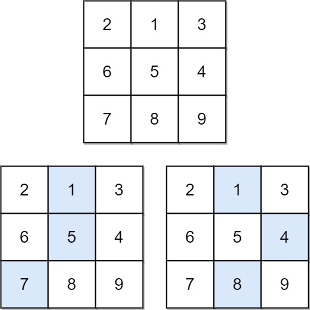

# [LeetCode][leetcode] task # 931: [Minimum Falling Path Sum][task]

Description
-----------

> Given an `n x n` array of integers `matrix`,
> return _the **minimum sum** of any **falling path** through `matrix`_.
> 
> A **falling path** starts at any element in the first row and chooses the element
> in the next row that is either directly below or diagonally left/right.
> Specifically, the next element from position `(row, col)` will be
> `(row + 1, col - 1)`, `(row + 1, col)`, or `(row + 1, col + 1)`.

 Example
-------



```sh
Input: matrix = [[2,1,3],[6,5,4],[7,8,9]]
Output: 13
Explanation: There are two falling paths with a minimum sum as shown.
```

Solution
--------

| Task | Solution                             |
|:----:|:-------------------------------------|
| 931  | [Minimum Falling Path Sum][solution] |


[leetcode]: <http://leetcode.com/>
[task]: <https://leetcode.com/problems/minimum-falling-path-sum/>
[solution]: <https://github.com/wellaxis/praxis-leetcode/blob/main/src/main/java/com/witalis/praxis/leetcode/task/h10/p931/option/Practice.java>
