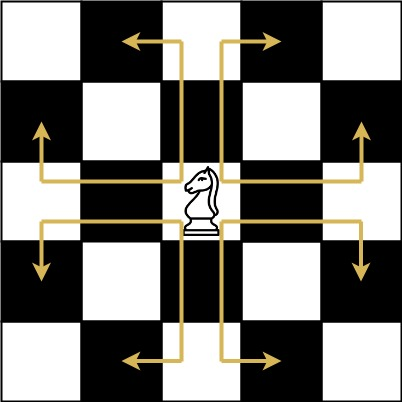
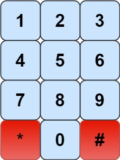

# [LeetCode][leetcode] task # 935: [Knight Dialer][task]

Description
-----------

> The chess knight has a **unique movement**, it may move two squares vertically and one square horizontally,
> or two squares horizontally and one square vertically (with both forming the shape of an **L**).
> The possible movements of chess knight are shown in this diagram:
>
> A chess knight can move as indicated in the chess diagram below:
> 
> 
> 
> We have a chess knight and a phone pad as shown below, the knight **can only stand on a numeric cell** (i.e. blue cell).
> 
> 
>
> Given an integer `n`, return _how many distinct phone numbers of length `n` we can dial_.
> 
> You are allowed to place the knight **on any numeric cell** initially,
> and then you should perform `n - 1` jumps to dial a number of length `n`.
> All jumps should be **valid** knight jumps.
> 
> As the answer may be very large, **return the answer modulo `10^9 + 7`**.

Example
-------

```sh
Input: n = 2
Output: 20
Explanation: All the valid number we can dial are [04, 06, 16, 18, 27, 29, 34, 38, 40, 43, 49, 60, 61, 67, 72, 76, 81, 83, 92, 94]
```

Solution
--------

| Task | Solution                  |
|:----:|:--------------------------|
| 935  | [Knight Dialer][solution] |


[leetcode]: <http://leetcode.com/>
[task]: <https://leetcode.com/problems/knight-dialer/>
[solution]: <https://github.com/wellaxis/praxis-leetcode/blob/main/src/main/java/com/witalis/praxis/leetcode/task/h10/p935/option/Practice.java>
