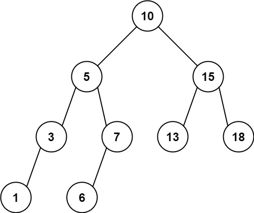

# [LeetCode][leetcode] task # 938: [Range Sum of BST][task]

Description
-----------

> Given the `root` node of a binary search tree and two integers `low` and `high`,
> return _the sum of values of all nodes with a value in the **inclusive** range `[low, high]`_.

 Example
-------



```sh
Input: root = [10,5,15,3,7,13,18,1,null,6], low = 6, high = 10
Output: 23
Explanation: Nodes 6, 7, and 10 are in the range [6, 10]. 6 + 7 + 10 = 23.
```

Solution
--------

| Task | Solution                     |
|:----:|:-----------------------------|
| 938  | [Range Sum of BST][solution] |


[leetcode]: <http://leetcode.com/>
[task]: <https://leetcode.com/problems/range-sum-of-bst/>
[solution]: <https://github.com/wellaxis/praxis-leetcode/blob/main/src/main/java/com/witalis/praxis/leetcode/task/h10/p938/option/Practice.java>
