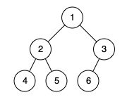

# [LeetCode][leetcode] task # 957: [Check Completeness of a Binary Tree][task]

Description
-----------

> Given the `root` of a binary tree, determine if it is a _complete binary tree_.
> 
> In a [complete binary tree][tree], every level, except possibly the last, is completely filled,
> and all nodes in the last level are as far left as possible.
> It can have between `1` and `2^h` nodes inclusive at the last level `h`.

 Example
-------



```sh
Input: root = [1,2,3,4,5,6]
Output: true
Explanation:
    Every level before the last is full (ie. levels with node-values {1} and {2, 3}),
    and all nodes in the last level ({4, 5, 6}) are as far left as possible.
```

Solution
--------

| Task | Solution                                        |
|:----:|:------------------------------------------------|
| 957  | [Check Completeness of a Binary Tree][solution] |


[leetcode]: <http://leetcode.com/>
[tree]: <https://en.wikipedia.org/wiki/Binary_tree#Types_of_binary_trees>
[task]: <https://leetcode.com/problems/check-completeness-of-a-binary-tree/>
[solution]: <https://github.com/wellaxis/praxis-leetcode/blob/main/src/main/java/com/witalis/praxis/leetcode/task/h10/p957/option/Practice.java>
