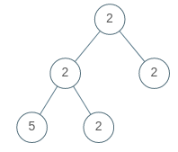

# [LeetCode][leetcode] task # 965: [Univalued Binary Tree][task]

Description
-----------

> A binary tree is **uni-valued** if every node in the tree has the same value.
> 
> Given the `root` of a binary tree, return _`true` if the given tree is **uni-valued**, or `false` otherwise_.

 Example
-------



```sh
Input: root = [2,2,2,5,2]
Output: false
```

Solution
--------

| Task | Solution                          |
|:----:|:----------------------------------|
| 965  | [Univalued Binary Tree][solution] |


[leetcode]: <http://leetcode.com/>
[tree]: <https://en.wikipedia.org/wiki/Binary_tree#Types_of_binary_trees>
[task]: <https://leetcode.com/problems/univalued-binary-tree/>
[solution]: <https://github.com/wellaxis/praxis-leetcode/blob/main/src/main/java/com/witalis/praxis/leetcode/task/h10/p965/option/Practice.java>
