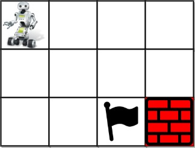

# [LeetCode][leetcode] task # 980: [Unique Paths III][task]

Description
-----------

> You are given an `m x n` integer array `grid` where `grid[i][j]` could be:
> * `1` representing the starting square. There is exactly one starting square.
> * `2` representing the ending square. There is exactly one ending square.
> * `0` representing empty squares we can walk over.
> * `-1` representing obstacles that we cannot walk over.
>
> Return _the number of 4-directional walks from the starting square to the ending square,
> that walk over every non-obstacle square exactly once_.

Example
-------



```sh
Input: grid = [[1,0,0,0],[0,0,0,0],[0,0,2,-1]]
Output: 2
Explanation: We have the following two paths: 
1. (0,0),(0,1),(0,2),(0,3),(1,3),(1,2),(1,1),(1,0),(2,0),(2,1),(2,2)
2. (0,0),(1,0),(2,0),(2,1),(1,1),(0,1),(0,2),(0,3),(1,3),(1,2),(2,2)
```

Solution
--------

| Task | Solution                     |
|:----:|:-----------------------------|
| 980  | [Unique Paths III][solution] |


[leetcode]: <http://leetcode.com/>
[task]: <https://leetcode.com/problems/unique-paths-iii/>
[solution]: <https://github.com/wellaxis/praxis-leetcode/blob/main/src/main/java/com/witalis/praxis/leetcode/task/h10/p980/option/Practice.java>
