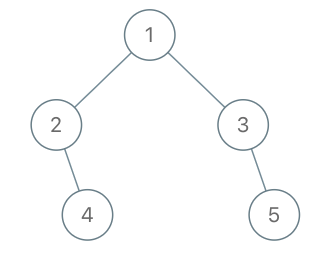

# [LeetCode][leetcode] task # 993: [Cousins in Binary Tree][task]

Description
-----------

> Given the `root` of a binary tree with unique values and the values of two different nodes of the tree `x` and `y`,
> return _`true` if the nodes corresponding to the values `x` and `y` in the tree are **cousins**, or `false` otherwise_.
> 
> Two nodes of a binary tree are **cousins** if they have the same depth with different parents.
> 
> Note that in a binary tree, the root node is at the depth `0`, and children of each depth `k` node are at the depth `k + 1`.

 Example
-------



```sh
Input: root = [1,2,3,null,4,null,5], x = 5, y = 4
Output: true
```

Solution
--------

| Task | Solution                           |
|:----:|:-----------------------------------|
| 993  | [Cousins in Binary Tree][solution] |


[leetcode]: <http://leetcode.com/>
[task]: <https://leetcode.com/problems/cousins-in-binary-tree/>
[solution]: <https://github.com/wellaxis/praxis-leetcode/blob/main/src/main/java/com/witalis/praxis/leetcode/task/h10/p993/option/Practice.java>
