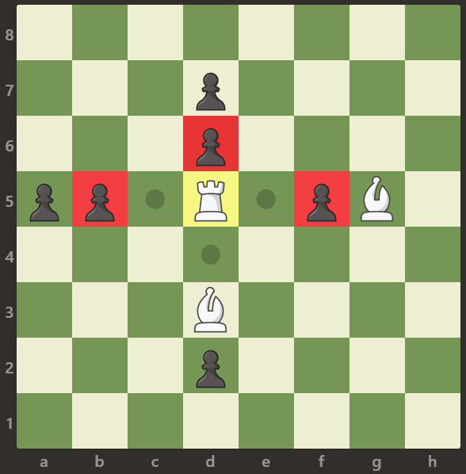

# [LeetCode][leetcode] task # 999: [Available Captures for Rook][task]

Description
-----------

> On an `8 x 8` chessboard, there is **exactly one** white rook `'R'`
> and some number of white bishops `'B'`, black pawns `'p'`, and empty squares `'.'`.
> 
> When the rook moves, it chooses one of four cardinal directions (north, east, south, or west),
> then moves in that direction until it chooses to stop, reaches the edge of the board,
> captures a black pawn, or is blocked by a white bishop.
> A rook is considered **attacking** a pawn if the rook can capture the pawn on the rook's turn.
> The **number of available captures** for the white rook is the number of pawns that the rook is **attacking**.
> 
> Return _the **number of available captures** for the white rook_.

 Example
-------



```sh
Input: board =
[
    [".",".",".",".",".",".",".","."],
    [".",".",".","p",".",".",".","."],
    [".",".",".","p",".",".",".","."],
    ["p","p",".","R",".","p","B","."],
    [".",".",".",".",".",".",".","."],
    [".",".",".","B",".",".",".","."],
    [".",".",".","p",".",".",".","."],
    [".",".",".",".",".",".",".","."]
]
Output: 3
Explanation: The rook is attacking the pawns at positions b5, d6, and f5.
```

Solution
--------

| Task | Solution                                |
|:----:|:----------------------------------------|
| 999  | [Available Captures for Rook][solution] |


[leetcode]: <http://leetcode.com/>
[task]: <https://leetcode.com/problems/available-captures-for-rook/>
[solution]: <https://github.com/wellaxis/praxis-leetcode/blob/main/src/main/java/com/witalis/praxis/leetcode/task/h10/p999/option/Practice.java>
