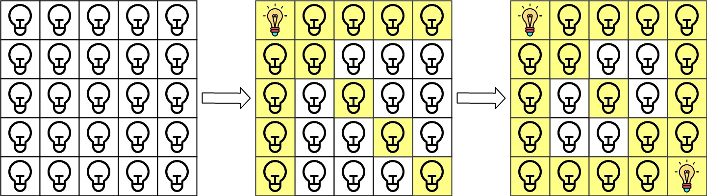
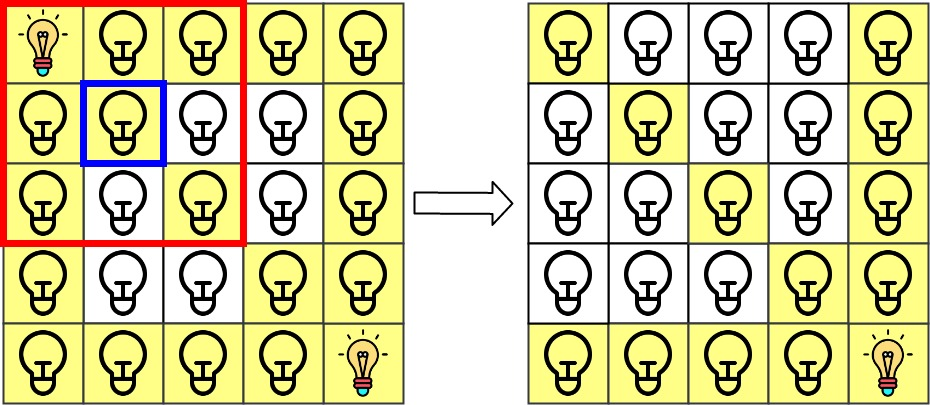
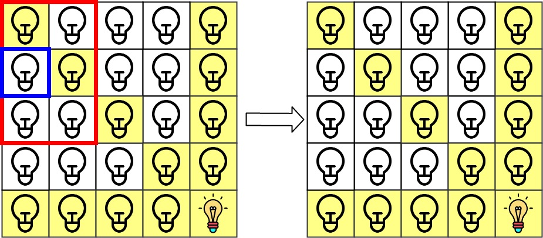

# [LeetCode][leetcode] task # 1001: [Grid Illumination][task]

Description
-----------

> There is a 2D `grid` of size `n x n` where each cell of this grid has a lamp that is initially **turned off**.
> 
> You are given a 2D array of lamp positions `lamps`, where `lamps[i] = [row[i], col[i]]` indicates
> that the lamp at `grid[row[i]][col[i]]` is **turned on**. Even if the same lamp is listed more than once, it is turned on.
> 
> When a lamp is turned on, it **illuminates its cell** and **all other cells** in the same **row, column, or diagonal**.
> 
> You are also given another 2D array `queries`, where `queries[j] = [row[j], col[j]]`.
> For the `j^th` query, determine whether `grid[row[j]][col[j]]` is illuminated or not.
> After answering the `j^th` query, **turn off** the lamp at `grid[row[j]][col[j]]` and its **8 adjacent lamps** if they exist.
> A lamp is adjacent if its cell shares either a side or corner with `grid[row[j]][col[j]]`.
> 
> Return _an array of integers `ans`, where `ans[j]` should be `1` if the cell in the `j^th` query was illuminated,
> or `0` if the lamp was not_.

Example
-------



```sh
Input: n = 5, lamps = [[0,0],[4,4]], queries = [[1,1],[1,0]]
Output: [1,0]
Explanation: We have the initial grid with all lamps turned off.
    In the above picture we see the grid after turning on the lamp at grid[0][0] then turning on the lamp at grid[4][4].
    The 0th query asks if the lamp at grid[1][1] is illuminated or not (the blue square). It is illuminated, so set ans[0] = 1. Then, we turn off all lamps in the red square.
```


> The 1st query asks if the lamp at grid[1][0] is illuminated or not (the blue square).
> It is not illuminated, so set ans[1] = 0. Then, we turn off all lamps in the red rectangle.



Solution
--------

| Task | Solution                      |
|:----:|:------------------------------|
| 1001 | [Grid Illumination][solution] |


[leetcode]: <http://leetcode.com/>
[task]: <https://leetcode.com/problems/grid-illumination/>
[solution]: <https://github.com/wellaxis/praxis-leetcode/blob/main/src/main/java/com/witalis/praxis/leetcode/task/h11/p1001/option/Practice.java>
