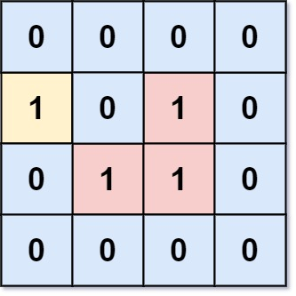

# [LeetCode][leetcode] task # 1020: [Number of Enclaves][task]

Description
-----------

> You are given an `m x n` binary matrix `grid`, where `0` represents a sea cell and `1` represents a land cell.
> 
> A **move** consists of walking from one land cell to another adjacent (**4-directionally**) land cell
> or walking off the boundary of the `grid`.
> 
> Return _the number of land cells in `grid` for which
> we cannot walk off the boundary of the grid in any number of **moves**_.

Example
-------



```sh
Input: grid = [[0,0,0,0],[1,0,1,0],[0,1,1,0],[0,0,0,0]]
Output: 3
Explanation: There are three 1s that are enclosed by 0s, and one 1 that is not enclosed because its on the boundary.).
```

Solution
--------

| Task | Solution                       |
|:----:|:-------------------------------|
| 1020 | [Number of Enclaves][solution] |


[leetcode]: <http://leetcode.com/>
[task]: <https://leetcode.com/problems/number-of-enclaves/>
[solution]: <https://github.com/wellaxis/praxis-leetcode/blob/main/src/main/java/com/witalis/praxis/leetcode/task/h11/p1020/option/Practice.java>
