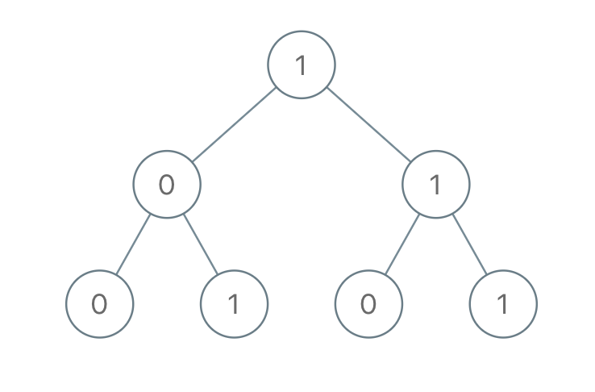

# [LeetCode][leetcode] task # 1022: [Sum of Root To Leaf Binary Numbers][task]

Description
-----------

> You are given the `root` of a binary tree where each node has a value `0` or `1`.
> Each root-to-leaf path represents a binary number starting with the most significant bit.
> 
> * For example, if the path is `0 -> 1 -> 1 -> 0 -> 1`, then this could represent `01101` in binary, which is `13`.
> 
> For all leaves in the tree, consider the numbers represented by the path from the root to that leaf
> Return _the sum of these numbers_.
> 
> The test cases are generated so that the answer fits in a **32-bits** integer.

 Example
-------



```sh
Input: root = [1,0,1,0,1,0,1]
Output: 22
Explanation: (100) + (101) + (110) + (111) = 4 + 5 + 6 + 7 = 22
```

Solution
--------

| Task | Solution                                       |
|:----:|:-----------------------------------------------|
| 1022 | [Sum of Root To Leaf Binary Numbers][solution] |


[leetcode]: <http://leetcode.com/>
[task]: <https://leetcode.com/problems/sum-of-root-to-leaf-binary-numbers/>
[solution]: <https://github.com/wellaxis/praxis-leetcode/blob/main/src/main/java/com/witalis/praxis/leetcode/task/h11/p1022/option/Practice.java>
