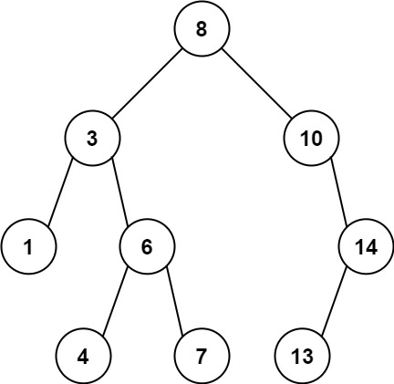

# [LeetCode][leetcode] task # 1026: [Maximum Difference Between Node and Ancestor][task]

Description
-----------

> Given the `root` of a binary tree, find the maximum value `v` for which there
> exist **different** nodes `a` and `b` where `v = |a.val - b.val|` and `a` is an ancestor of `b`.
> 
> A node `a` is an ancestor of `b` if either:
> any child of `a` is equal to `b` or any child of `a` is an ancestor of `b`.

 Example
-------



```sh
Input: root = [8,3,10,1,6,null,14,null,null,4,7,13]
Output: 7
Explanation: We have various ancestor-node differences, some of which are given below :
|8 - 3| = 5
|3 - 7| = 4
|8 - 1| = 7
|10 - 13| = 3
Among all possible differences, the maximum value of 7 is obtained by |8 - 1| = 7.
```

Solution
--------

| Task | Solution                                                 |
|:----:|:---------------------------------------------------------|
| 1026 | [Maximum Difference Between Node and Ancestor][solution] |


[leetcode]: <http://leetcode.com/>
[task]: <https://leetcode.com/problems/maximum-difference-between-node-and-ancestor/>
[solution]: <https://github.com/wellaxis/praxis-leetcode/blob/main/src/main/java/com/witalis/praxis/leetcode/task/h11/p1026/option/Practice.java>
