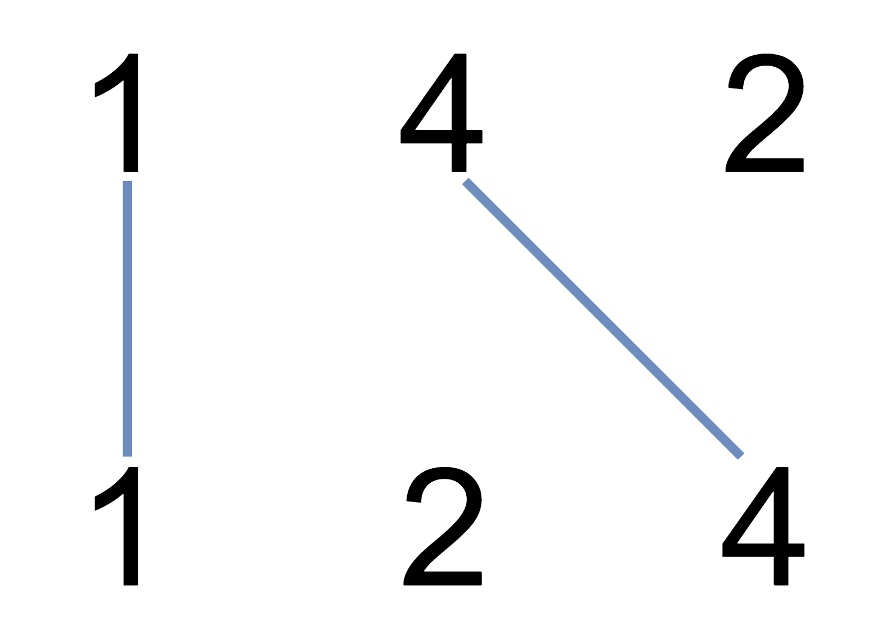

# [LeetCode][leetcode] task # 1035: [Uncrossed Lines][task]

Description
-----------

> You are given two integer arrays `nums1` and `nums2`.
> We write the integers of `nums1` and `nums2` (in the order they are given) on two separate horizontal lines.
> 
> We may draw connecting lines: a straight line connecting two numbers `nums1[i]` and `nums2[j]` such that:
> * `nums1[i] == nums2[j]`, and
> * the line we draw does not intersect any other connecting (non-horizontal) line.
>
> Note that a connecting line cannot intersect even at the endpoints
> (i.e., each number can only belong to one connecting line).
> 
> Return _the maximum number of connecting lines we can draw in this way_.

Example
-------




```sh
Input: nums1 = [1,4,2], nums2 = [1,2,4]
Output: 2
Explanation: We can draw 2 uncrossed lines as in the diagram.
    We cannot draw 3 uncrossed lines, because the line from nums1[1] = 4 to nums2[2] = 4
    will intersect the line from nums1[2]=2 to nums2[1]=2.
```

Solution
--------

| Task | Solution                    |
|:----:|:----------------------------|
| 1035 | [Uncrossed Lines][solution] |


[leetcode]: <http://leetcode.com/>
[task]: <https://leetcode.com/problems/uncrossed-lines/>
[solution]: <https://github.com/wellaxis/praxis-leetcode/blob/main/src/main/java/com/witalis/praxis/leetcode/task/h11/p1035/option/Practice.java>
