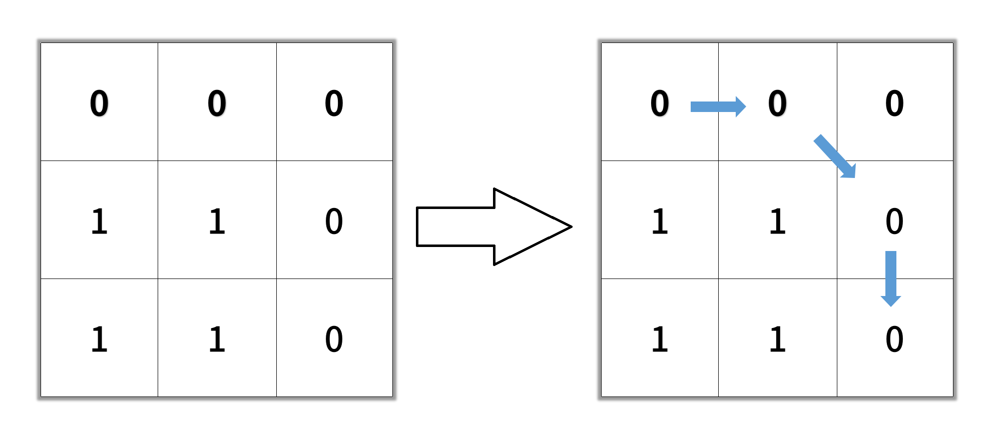

# [LeetCode][leetcode] task # 1091: [Shortest Path in Binary Matrix][task]

Description
-----------

> Given an `n x n` binary matrix `grid`,
> return _the length of the shortest **clear path** in the matrix_. If there is no clear path, return `-1`.
> 
> A **clear path** in a binary matrix is a path from the **top-left** cell (i.e., `(0, 0)`)
> to the **bottom-right** cell (i.e., `(n - 1, n - 1)`) such that:
> * All the visited cells of the path are `0`.
> * All the adjacent cells of the path are **8-directionally** connected
> (i.e., they are different, and they share an edge or a corner).
>
> The **length of a clear path** is the number of visited cells of this path.

 Example
-------



```sh
Input: grid = [[0,0,0],[1,1,0],[1,1,0]]
Output: 4
```

Solution
--------

| Task | Solution                                   |
|:----:|:-------------------------------------------|
| 1091 | [Shortest Path in Binary Matrix][solution] |


[leetcode]: <http://leetcode.com/>
[task]: <https://leetcode.com/problems/shortest-path-in-binary-matrix/description/>
[solution]: <https://github.com/wellaxis/praxis-leetcode/blob/main/src/main/java/com/witalis/praxis/leetcode/task/h11/p1091/option/Practice.java>
