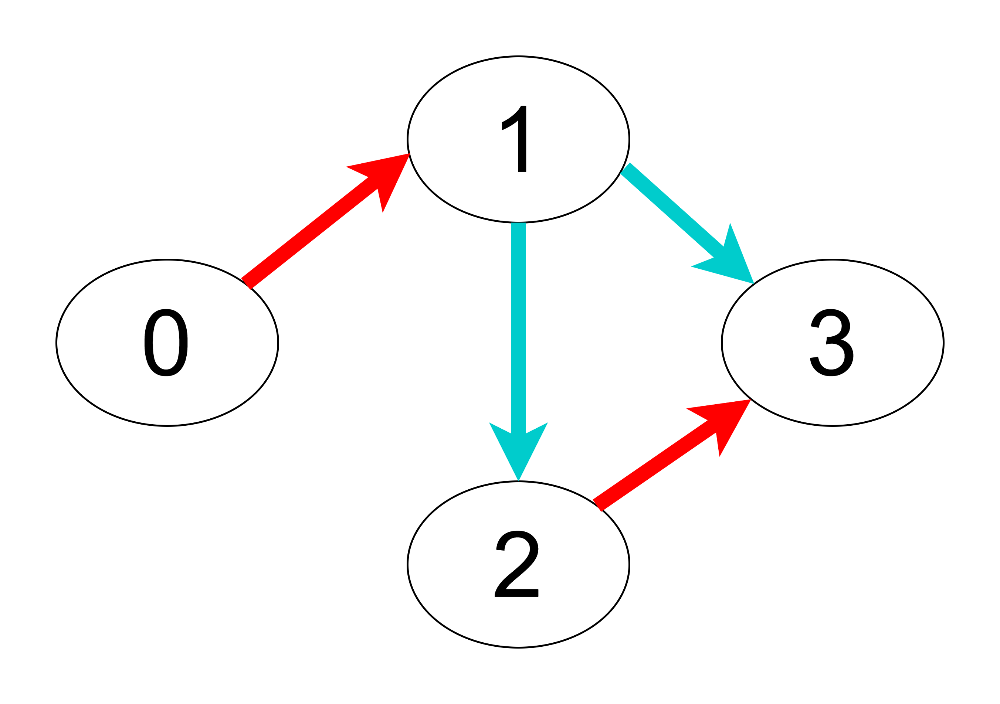

# [LeetCode][leetcode] task # 1129: [Shortest Path with Alternating Colors][task]

Description
-----------

> You are given an integer `n`, the number of nodes in a directed graph where the nodes are labeled from `0` to `n - 1`.
> Each edge is red or blue in this graph, and there could be self-edges and parallel edges.
> 
> You are given two arrays `redEdges` and `blueEdges` where:
> * `redEdges[i] = [ai, bi]` indicates that there is a directed red edge from node `ai` to node `bi` in the graph, and
> * `blueEdges[j] = [uj, vj]` indicates that there is a directed blue edge from node `uj` to node `vj` in the graph.
>
> Return an array `answer` of length `n`, where each `answer[x]` is the length
> of the shortest path from node `0` to node `x` such that the edge colors alternate along the path,
> or `-1` if such a path does not exist.

 Example
-------



```sh
Input: n = 4, redEdges = [[0, 1], [2, 3]], blueEdges = [[1, 2], [1, 3]]
Output: The shortest paths for each node from node '0' are: [0, 1, 2, 2]
    1: 0->1    // Length: 1
    2: 0->1->2 // Length: 2
    3: 0->1->3 // Length: 2
```

Solution
--------

| Task | Solution                                          |
|:----:|:--------------------------------------------------|
| 1129 | [Shortest Path with Alternating Colors][solution] |


[leetcode]: <http://leetcode.com/>
[task]: <https://leetcode.com/problems/shortest-path-with-alternating-colors/>
[solution]: <https://github.com/wellaxis/praxis-leetcode/blob/main/src/main/java/com/witalis/praxis/leetcode/task/h12/p1129/option/Practice.java>
