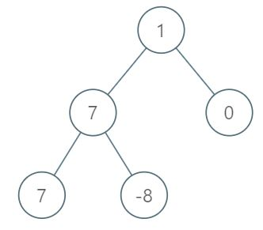

# [LeetCode][leetcode] task # 1161: [Maximum Level Sum of a Binary Tree][task]

Description
-----------

> Given the `root` of a binary tree, the level of its root is `1`, the level of its children is `2`, and so on.
> 
> Return _the **smallest** level `x` such that the sum of all the values of nodes at level `x` is **maximal**_.

 Example
-------



```sh
Input: root = [1,7,0,7,-8,null,null]
Output: 2
Explanation: 
    Level 1 sum = 1.
    Level 2 sum = 7 + 0 = 7.
    Level 3 sum = 7 + -8 = -1.
So we return the level with the maximum sum which is level 2.
```

Solution
--------

| Task | Solution                                       |
|:----:|:-----------------------------------------------|
| 1161 | [Maximum Level Sum of a Binary Tree][solution] |


[leetcode]: <http://leetcode.com/>
[task]: <https://leetcode.com/problems/maximum-level-sum-of-a-binary-tree/>
[solution]: <https://github.com/wellaxis/praxis-leetcode/blob/main/src/main/java/com/witalis/praxis/leetcode/task/h12/p1161/option/Practice.java>
