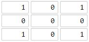

# [LeetCode][leetcode] task # 1162: [As Far from Land as Possible][task]

Description
-----------

> Given an `n x n` `grid` containing only values `0` and `1`, where `0` represents water and `1` represents land,
> find a water cell such that its distance to the nearest land cell is maximized, and return the distance.
> If no land or water exists in the grid, return `-1`.
> 
> The distance used in this problem is the Manhattan distance:
> the distance between two cells `(x0, y0)` and `(x1, y1)` is `|x0 - x1| + |y0 - y1|`.

 Example
-------



```sh
Input: grid = [[1,0,1],[0,0,0],[1,0,1]]
Output: 2
Explanation: The cell (1, 1) is as far as possible from all the land with distance 2.
```

Solution
--------

| Task | Solution                                 |
|:----:|:-----------------------------------------|
| 1162 | [As Far from Land as Possible][solution] |


[leetcode]: <http://leetcode.com/>
[task]: <https://leetcode.com/problems/as-far-from-land-as-possible/>
[solution]: <https://github.com/wellaxis/praxis-leetcode/blob/main/src/main/java/com/witalis/praxis/leetcode/task/h12/p1162/option/Practice.java>
