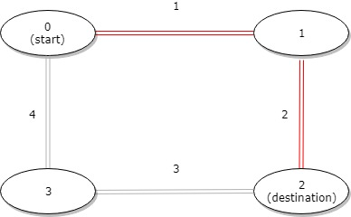

# [LeetCode][leetcode] task # 1184: [Distance Between Bus Stops][task]

Description
-----------

> A bus has `n` stops numbered from `0` to `n - 1` that form a circle.
> We know the distance between all pairs of neighboring stops where
> `distance[i]` is the distance between the stops number `i` and `(i + 1) % n`.
> 
> The bus goes along both directions i.e. clockwise and counterclockwise.
> 
> Return _the shortest distance between the given `start` and `destination` stops_.

Example
-------



```sh
Input: distance = [1,2,3,4], start = 0, destination = 2
Output: 3
Explanation: Distance between 0 and 2 is 3 or 7, minimum is 3.
```

Solution
--------

| Task | Solution                               |
|:----:|:---------------------------------------|
| 1184 | [Distance Between Bus Stops][solution] |


[leetcode]: <http://leetcode.com/>
[task]: <https://leetcode.com/problems/distance-between-bus-stops/>
[solution]: <https://github.com/wellaxis/praxis-leetcode/blob/main/src/main/java/com/witalis/praxis/leetcode/task/h12/p1184/option/Practice.java>
