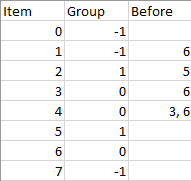

# [LeetCode][leetcode] task # 1203: [Sort Items by Groups Respecting Dependencies][task]

Description
-----------

> There are `n` items each belonging to zero or one of `m` groups where `group[i]` is the group
> that the `i`-th item belongs to, and it's equal to `-1` if the `i`-th item belongs to no group.
> The items and the groups are zero indexed. A group can have no item belonging to it.
> 
> Return a sorted list of the items such that:
> * The items that belong to the same group are next to each other in the sorted list.
> * There are some relations between these items where `beforeItems[i]` is a list
> containing all the items that should come before the `i`-th item in the sorted array (to the left of the `i`-th item).
>
> Return any solution if there is more than one solution and return an **empty list** if there is no solution.

Example
-------



```sh
Input: n = 8, m = 2, group = [-1,-1,1,0,0,1,0,-1], beforeItems = [[],[6],[5],[6],[3,6],[],[],[]]
Output: [6,3,4,1,5,2,0,7]
```

Solution
--------

| Task | Solution                                                 |
|:----:|:---------------------------------------------------------|
| 1203 | [Sort Items by Groups Respecting Dependencies][solution] |


[leetcode]: <http://leetcode.com/>
[task]: <https://leetcode.com/problems/sort-items-by-groups-respecting-dependencies/>
[solution]: <https://github.com/wellaxis/praxis-leetcode/blob/main/src/main/java/com/witalis/praxis/leetcode/task/h13/p1203/option/Practice.java>
