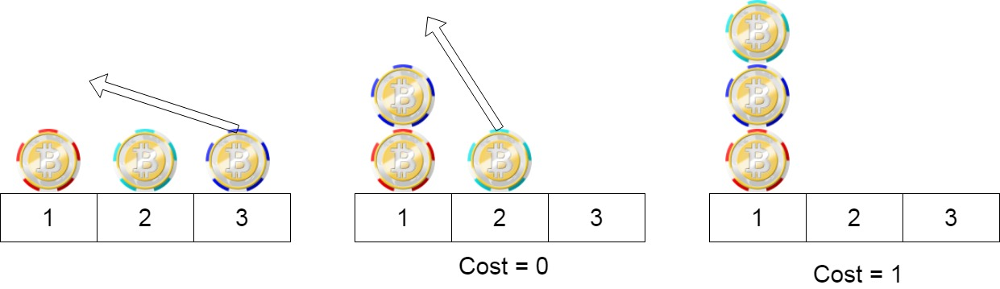

# [LeetCode][leetcode] task # 1217: [Minimum Cost to Move Chips to The Same Position][task]

Description
-----------

> We have `n` chips, where the position of the `i^th` chip is `position[i]`.
> 
> We need to move all the chips to **the same position**.
> In one step, we can change the position of the `i^th` chip from `position[i]` to:
> * `position[i] + 2` or `position[i] - 2` with `cost = 0`.
> * `position[i] + 1` or `position[i] - 1` with `cost = 1`.
>
> Return _the minimum cost needed to move all the chips to the same position_.

Example
-------



```sh
Input: position = [1,2,3]
Output: 1
Explanation: First step: Move the chip at position 3 to position 1 with cost = 0.
    Second step: Move the chip at position 2 to position 1 with cost = 1.
    Total cost is 1.
```

Solution
--------

| Task | Solution                                                    |
|:----:|:------------------------------------------------------------|
| 1217 | [Minimum Cost to Move Chips to The Same Position][solution] |


[leetcode]: <http://leetcode.com/>
[task]: <https://leetcode.com/problems/minimum-cost-to-move-chips-to-the-same-position/>
[solution]: <https://github.com/wellaxis/praxis-leetcode/blob/main/src/main/java/com/witalis/praxis/leetcode/task/h13/p1217/option/Practice.java>
