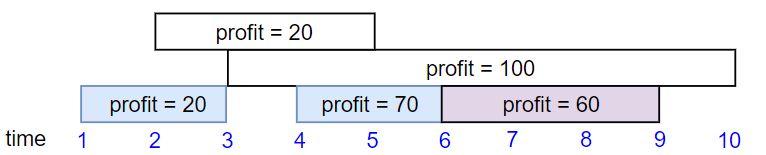

# [LeetCode][leetcode] task # 1235: [Maximum Profit in Job Scheduling][task]

Description
-----------

> We have `n` jobs, where every job is scheduled to be done from `startTime[i]` to `endTime[i]`,
> obtaining a profit of `profit[i]`.
> 
> You're given the `startTime`, `endTime` and `profit` arrays, return the maximum profit you can take such
> that there are no two jobs in the subset with overlapping time range.
> 
> If you choose a job that ends at time `X` you will be able to start another job that starts at time `X`.

Example
-------



```sh
Input: startTime = [1,2,3,4,6], endTime = [3,5,10,6,9], profit = [20,20,100,70,60]
Output: 150
Explanation: The subset chosen is the first, fourth and fifth job. Profit obtained 150 = 20 + 70 + 60.
```

Solution
--------

| Task | Solution                                     |
|:----:|:---------------------------------------------|
| 1235 | [Maximum Profit in Job Scheduling][solution] |


[leetcode]: <http://leetcode.com/>
[task]: <https://leetcode.com/problems/maximum-profit-in-job-scheduling/>
[solution]: <https://github.com/wellaxis/praxis-leetcode/blob/main/src/main/java/com/witalis/praxis/leetcode/task/h13/p1235/option/Practice.java>
