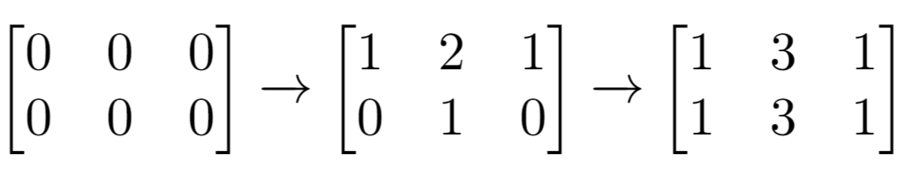

# [LeetCode][leetcode] task # 1252: [Cells with Odd Values in a Matrix][task]

Description
-----------

> There is an `m x n` matrix that is initialized to all `0`'s.
> There is also a 2D array `indices` where each `indices[i] = [ri, ci]` represents
> a **0-indexed location** to perform some increment operations on the matrix.
> 
> For each location `indices[i]`, do both of the following:
> 1. Increment **all** the cells on row `ri`.
> 2. Increment **all** the cells on column `ci`.
>
> Given `m`, `n`, and `indices`, return _the **number of odd-valued cells** in the matrix
> after applying the increment to all locations in `indices`_.

Example
-------



```sh
Input: m = 2, n = 3, indices = [[0,1],[1,1]]
Output: 6
Explanation: Initial matrix = [[0,0,0],[0,0,0]].
    After applying first increment it becomes [[1,2,1],[0,1,0]].
    The final matrix is [[1,3,1],[1,3,1]], which contains 6 odd numbers.
```

Solution
--------

| Task | Solution                                      |
|:----:|:----------------------------------------------|
| 1252 | [Cells with Odd Values in a Matrix][solution] |


[leetcode]: <http://leetcode.com/>
[task]: <https://leetcode.com/problems/cells-with-odd-values-in-a-matrix/>
[solution]: <https://github.com/wellaxis/praxis-leetcode/blob/main/src/main/java/com/witalis/praxis/leetcode/task/h13/p1252/option/Practice.java>
