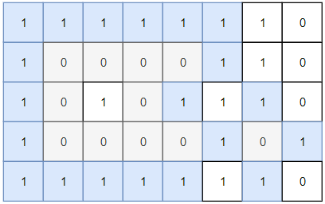

# [LeetCode][leetcode] task # 1254: [Number of Closed Islands][task]

Description
-----------

> Given a 2D `grid` consists of `0s` (land) and `1s` (water).
> An `island` is a maximal 4-directionally connected group of `0s`
> and a `closed island` is an island **totally** (all left, top, right, bottom) surrounded by `1s`.
> 
> Return _the number of closed islands_.

Example
-------



```sh
Input: grid = [[1,1,1,1,1,1,1,0],[1,0,0,0,0,1,1,0],[1,0,1,0,1,1,1,0],[1,0,0,0,0,1,0,1],[1,1,1,1,1,1,1,0]]
Output: 2
Explanation: Islands in gray are closed because they are completely surrounded by water (group of 1s).
```

Solution
--------

| Task | Solution                             |
|:----:|:-------------------------------------|
| 1254 | [Number of Closed Islands][solution] |


[leetcode]: <http://leetcode.com/>
[task]: <https://leetcode.com/problems/number-of-closed-islands/>
[solution]: <https://github.com/wellaxis/praxis-leetcode/blob/main/src/main/java/com/witalis/praxis/leetcode/task/h13/p1254/option/Practice.java>
