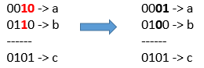

# [LeetCode][leetcode] task # 1318: [Minimum Flips to Make a OR b Equal to c][task]

Description
-----------

> Given 3 positives numbers `a`, `b` and `c`.
> Return _the minimum flips required in some bits of `a` and `b` to make ( `a` OR `b` == `c` )_. (bitwise OR operation).
> 
> Flip operation consists of change **any**! single bit 1 to 0 or change the bit 0 to 1 in their binary representation.

Example
-------



```sh
Input: a = 2, b = 6, c = 5
Output: 3
Explanation: After flips a = 1 , b = 4 , c = 5 such that (a OR b == c)
```

Solution
--------

| Task | Solution                                            |
|:----:|:----------------------------------------------------|
| 1318 | [Minimum Flips to Make a OR b Equal to c][solution] |


[leetcode]: <http://leetcode.com/>
[task]: <https://leetcode.com/problems/minimum-flips-to-make-a-or-b-equal-to-c/>
[solution]: <https://github.com/wellaxis/praxis-leetcode/blob/main/src/main/java/com/witalis/praxis/leetcode/task/h14/p1318/option/Practice.java>
