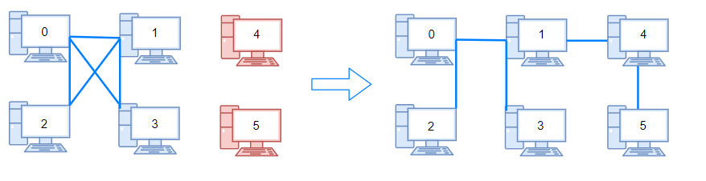

# [LeetCode][leetcode] task # 1319: [Number of Operations to Make Network Connected][task]

Description
-----------

> There are `n` computers numbered from `0` to `n - 1` connected by ethernet cables `connections`
> forming a network where `connections[i] = [a[i], b[i]]` represents a connection between computers `a[i]` and `b[i]`.
> Any computer can reach any other computer directly or indirectly through the network.
> 
> You are given an initial computer network `connections`.
> You can extract certain cables between two directly connected computers,
> and place them between any pair of disconnected computers to make them directly connected.
> 
> Return _the minimum number of times you need to do this in order to make all the computers connected_.
> If it is not possible, return `-1`.

 Example
-------



```sh
Input: n = 6, connections = [[0,1],[0,2],[0,3],[1,2],[1,3]]
Output: 2
```

Solution
--------

| Task | Solution                                                   |
|:----:|:-----------------------------------------------------------|
| 1319 | [Number of Operations to Make Network Connected][solution] |


[leetcode]: <http://leetcode.com/>
[task]: <https://leetcode.com/problems/number-of-operations-to-make-network-connected/>
[solution]: <https://github.com/wellaxis/praxis-leetcode/blob/main/src/main/java/com/witalis/praxis/leetcode/task/h14/p1319/option/Practice.java>
