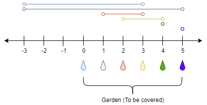

# [LeetCode][leetcode] task # 1326: [Minimum Number of Taps to Open to Water a Garden][task]

Description
-----------

> There is a one-dimensional garden on the x-axis.
> The garden starts at the point `0` and ends at the point `n`. (i.e The length of the garden is `n`).
> 
> There are `n + 1` taps located at points `[0, 1, ..., n]` in the garden.
> 
> Given an integer `n` and an integer array `ranges` of length `n + 1` where
> `ranges[i]` (0-indexed) means the `i-th` tap can water the area `[i - ranges[i], i + ranges[i]]` if it was open.
> 
> Return _the minimum number of taps_ that should be open to water the whole garden
> If the garden cannot be watered return **-1**.

Example
-------



```sh
Input: n = 5, ranges = [3,4,1,1,0,0]
Output: 1
Explanation:
    The tap at point 0 can cover the interval [-3,3]
    The tap at point 1 can cover the interval [-3,5]
    The tap at point 2 can cover the interval [1,3]
    The tap at point 3 can cover the interval [2,4]
    The tap at point 4 can cover the interval [4,4]
    The tap at point 5 can cover the interval [5,5]
    Opening Only the second tap will water the whole garden [0,5]
```

Solution
--------

| Task | Solution                                                     |
|:----:|:-------------------------------------------------------------|
| 1326 | [Minimum Number of Taps to Open to Water a Garden][solution] |


[leetcode]: <http://leetcode.com/>
[task]: <https://leetcode.com/problems/minimum-number-of-taps-to-open-to-water-a-garden/>
[solution]: <https://github.com/wellaxis/praxis-leetcode/blob/main/src/main/java/com/witalis/praxis/leetcode/task/h14/p1326/option/Practice.java>
