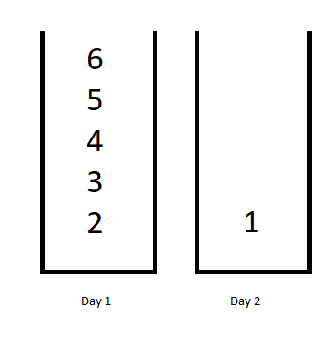

# [LeetCode][leetcode] task # 1335: [Minimum Difficulty of a Job Schedule][task]

Description
-----------

> You want to schedule a list of jobs in `d` days.
> Jobs are dependent (i.e To work on the `i^th` job, you have to finish all the jobs `j` where `0 <= j < i`).
> 
> You have to finish **at least** one task every day.
> The difficulty of a job schedule is the sum of difficulties of each day of the `d` days.
> The difficulty of a day is the maximum difficulty of a job done on that day.
> 
> You are given an integer array `jobDifficulty` and an integer `d`.
> The difficulty of the `i^th` job is `jobDifficulty[i]`.
> 
> Return _the minimum difficulty of a job schedule_. If you cannot find a schedule for the jobs return `-1`.

Example
-------



```sh
Input: jobDifficulty = [6,5,4,3,2,1], d = 2
Output: 7
Explanation: First day you can finish the first 5 jobs, total difficulty = 6.
    Second day you can finish the last job, total difficulty = 1.
    The difficulty of the schedule = 6 + 1 = 7 
```

Solution
--------

| Task | Solution                                         |
|:----:|:-------------------------------------------------|
| 1335 | [Minimum Difficulty of a Job Schedule][solution] |


[leetcode]: <http://leetcode.com/>
[task]: <https://leetcode.com/problems/minimum-difficulty-of-a-job-schedule/>
[solution]: <https://github.com/wellaxis/praxis-leetcode/blob/main/src/main/java/com/witalis/praxis/leetcode/task/h14/p1335/option/Practice.java>
