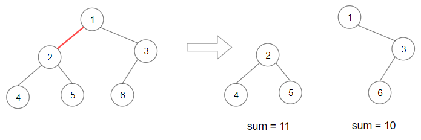

# [LeetCode][leetcode] task # 1339: [Maximum Product of Splitted Binary Tree][task]

Description
-----------

> Given the `root` of a binary tree, split the binary tree into two subtrees by removing one edge
> such that the product of the sums of the subtrees is maximized.
> 
> Return _the maximum product of the sums of the two subtrees_.
> Since the answer may be too large, return it **modulo** 10^9 + 7.
> 
> **Note** that you need to maximize the answer before taking the mod and not after taking it.

 Example
-------



```sh
Input: root = [1,2,3,4,5,6]
Output: 110
Explanation: Remove the red edge and get 2 binary trees with sum 11 and 10. Their product is 110 (11*10)
```

Solution
--------

| Task | Solution                                            |
|:----:|:----------------------------------------------------|
| 1339 | [Maximum Product of Splitted Binary Tree][solution] |


[leetcode]: <http://leetcode.com/>
[task]: <https://leetcode.com/problems/maximum-product-of-splitted-binary-tree/>
[solution]: <https://github.com/wellaxis/praxis-leetcode/blob/main/src/main/java/com/witalis/praxis/leetcode/task/h14/p1339/option/Practice.java>
